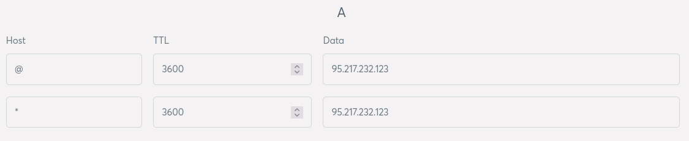

# Traefik VM

Use [Ansible](https://docs.ansible.com/ansible/latest/index.html) to configure a remote machine running Ubuntu 22.04 LTS.

Such that:

- Traefik is installed and started as a SystemD user service.
- Certificates are automatically created and renewed by Treafik.
- Network traffic on port 80 (http), 443 (https), 8080 (Treafik) and 8443 (Treafik) are allowed.
- Traffic on port 80 is routed to port 8080, and traffic on port 443 is routed to port 8443.

This repo requires you to first setup you VM using [Basic VM](https://github.com/andrtell/basic-vm). 

## Domain

Go ahead register a domain name (e.g. `example.com`) and point it to your VM if you have not already.

**Optional (but recommended)**

Add a wildcard domain for your sub-domains (e.g `*.example.com`). The wildcard domain should resolve to the same IP as your top domain.

**Warning**

If you are updating existing DNS records, please wait a while (make note of TTL) before running Traefik. It is very easy to hit the rate limit over at Lets Encrypt if your DNS records are not up to date.

**Example of some DNS A records**



## Local setup

### Ansible

Ansible needs to know about your remote machine.

*Before you continue*

Create the file `inventory.yaml` in the root folder of this repo.

```
ungrouped:
  hosts:
    vm01:
      ansible_host: <YOUR-DOMAIN>
```

(Replace `<YOUR-DOMAIN>` with your domain).

## Remote setup

This step will be run as `agent`.

You will be prompted for the `sudo` password you provided in the `Basic VM` setup.

This step will install and start Traefik and configure the firewall on the remote machine.

Lets encrypt will send informative emails to you. 

*Before you continue*

Run all the playbooks.

```
ansible-playbook -i inventory.yaml --ask-become-pass --extra-vars "lets_encrypt_email=<YOUR-EMAIL>" playbooks/*.yaml
```
(Replace `<YOUR-EMAIL>` with your email).

## Test it

Start a http server using podman remote (see `Basic VM`).

```
podman -r -c vm01 run \
  -d --rm --name httpd --network traefik \
  --label 'traefik.enable=true' \
  --label 'traefik.http.routers.httpd.rule=Host(`<YOUR-DOMAIN>`)' \
  --label 'traefik.http.routers.httpd.entrypoints=websecure' \
  --label 'traefik.http.routers.httpd.tls=true' \
  --label 'traefik.http.routers.httpd.tls.certresolver=letsencrypt' \
  docker.io/httpd
```

(Replace `<YOUR-DOMAIN>` with your domain).

Visit `https://<YOUR-DOMAIN>` to see if it works.

To stop the server.

```
podman -r -c vm01 stop httpd
```

**OK, all done!**
